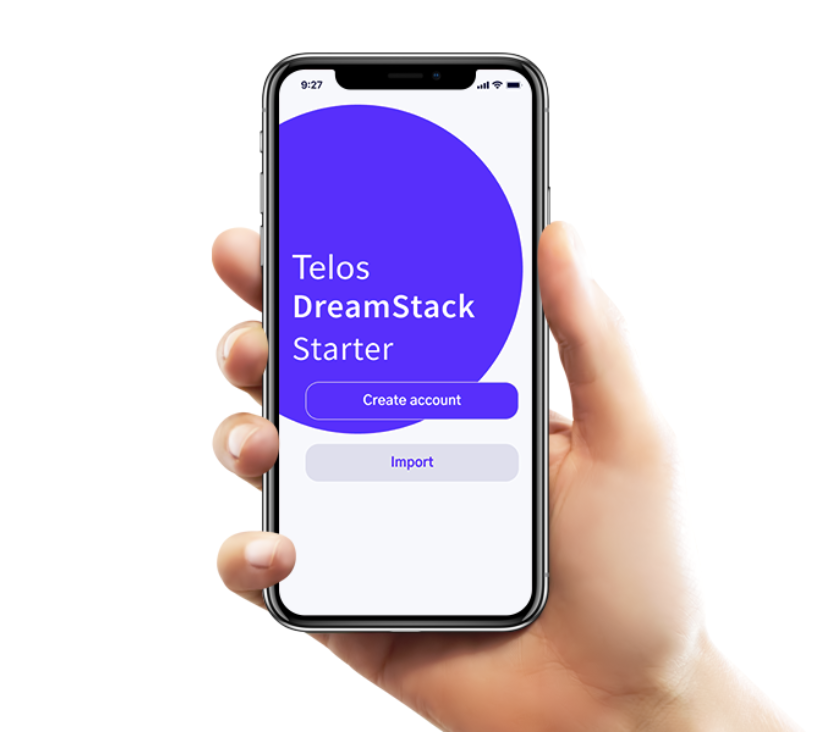
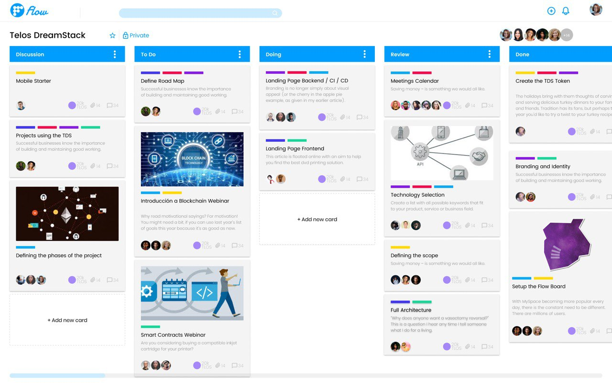
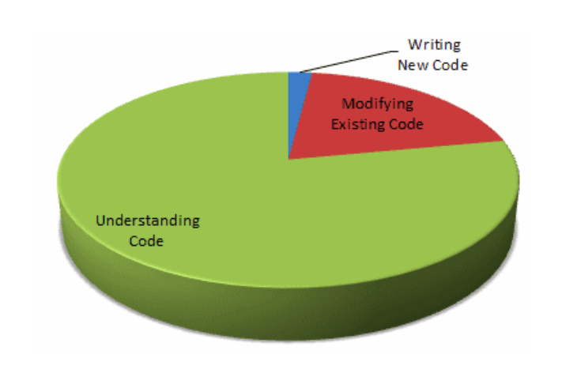
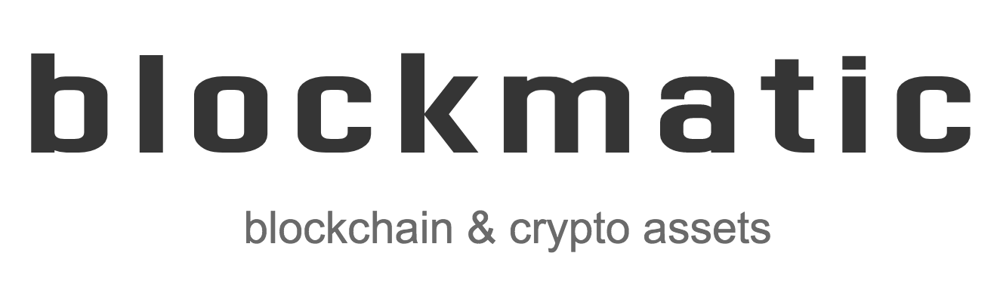

In December 2019, Blockmatic with the sponsorship of CSX and Bitcash started to work on the Telos DreamStack, a project that aims to facilitate faster time to market by providing a ready to go whitelabel apps and a well-documented framework for building applications using Telos and the latest frontend technology for performant user interfaces.

The ultimate goal of DreamStack is to provide a way to quickly jumpstart development removing tech overhead and allowing you to focus on your business model and product features, reducing costs to develop high-quality blockchain apps and functional proofs of concept.

The main objectives of the project are:

- Reduce the time and effort required to launch applications on Telos.
- Help position Telos as one of the best networks for dapps.
- Provide reliable real-time graphql endpoints for dapps.
- Provide best in class dapp starters.
- Simplify developer on-boarding.
- Provide a better developer experience.
- Reduce work duplication and maximize development synergy.
- Promote better user experiences in dapps.
- Strengthen the developer community.

DreamStack is open source and the code is available at [github.com/Telosdreamstack](https://github.com/Telosdreamstack). Documentation is being worked on [docs.Telosdreamstack.io](https://docs.Telosdreamstack.io) and it counts with its own [telegram group for support](https://t.me/Telosdreamstack). Online webinars, video tutorials, onsite workshops, and hackathons will help foster the DreamStack development community.

It focuses on providing everything required to build performant real-time blockchain applications with Telos and React, featuring application starters for mobile, web and desktop with the following functionalities:

- Create TLOS free accounts and profiles.
- Secure key imports.
- 6 digit pin key encryption in mobile,
- Password for key encryption in desktop.
- Real-time balances and permissions.
- Token transfers.
- Push notifications.

## Projects

These projects are currently waiting for DreamStack. We realized all these projects needed the same functionalities so we built the framework.

### Flow Kanban

Flow Kanban is a native desktop application that features a Trello like kanban board with crypto incentives attached to them. Each card is an escrow contract. It can support both custom permission and liquid voting on cards for approval and quality assurance.

### Bitcash 100x

A novel collateralized stablecoin system that empowers users who deposit TLOS in the community platform. 80% of revenue proceeds from exchange, payment, investment & lending services reward depositors. This system automatically generates fiat stablecoins for users and has the potential to generate other derivative assets in the future for use & trade. The first trading application called 100x makes trading secure and simple and leverages the bitcash system to provide a liquid TLOS /USD exchange with leverage.

### Krown DAC Notifier

The Mobile DAC Notifier is a mobile app that allows you to receive notifications and vote on DAC proposals right on the phone. It’ll support eosDAC and Telos Decide based projects. A lot of people participate in several DACs, they will be able to track and respond to all proposals from the same app.

## DreamStack Roadmap

March 2020:

- Project website.
- Finalize app starters' design.
- Reactive demux.

April 2020:

- GraphQL service.
- Mobile starter.
- React web starter.

May 2020:

- Desktop starter.
- LiquidLink support.
- EOSIO signing request support.
- Start a marketing campaign.

We created two proposals on Telos Works with more detailed information on the reactive demux component and design work.

- DreamStack Design and Landing Page:   
https://chainspector.io/governance/worker-proposals/125
- Reactive Demux by DreamStack:   
https://chainspector.io/governance/worker-proposals/124

## Technical Specs

The Telos DreamStack features the most efficient technology and standards for building performant JavaScript applications as of today. The technology selection was based on more than 10 years of experience developing applications and collaboration with experts on the different tools of which the framework is composed.

Application performance is a critical factor in the success of a project, and a major indicator of software quality. It is even one of the essential criteria that determine user satisfaction. DreamStack makes emphasis on meeting human-centric performance metrics such as Time To Interactive and First Contentful Paint.

Software maintainability is defined as the degree to which an application is understood, repaired, or enhanced; Developers spent most of their time understanding other people's code, and that is not a trivial endeavor; therefore, it is important to adhere to clear conventions so that the next developer has as little overhead as possible when reading your code.

dapps benefit from sharing a common codebase they all contribute to enhance and extend. The shared guidelines allow developers to avoid the context switching overhead when working on different applications or codebases, and for developers completely new to the technologies it is way easier to start with clear guidelines and starters.

All the code follows Functional and Declarative style enforced by automated linting and formatting, as well as thoughtful peer reviews. TypeScript is used to validate parameters at compile time allowing us to detect bugs earlier and reduce risk of introducing bugs at run time.

These starters are easily customizable/themeable through CSS in JS using ThemeUI and Emotion Mobile. The theme is saved as a JSON object you can customize with your color palette and typography easily.

### GraphQL Engine

DreamStack GraphQL is powered by Hasura GraphQL engine which is kept is sync with the blockchain through a Reactive Demux service built with RXJS data pipelines from EOSIO state sockets. Its open core supports real-time graph subscriptions to account balances, permissions and consume Telos Decide features.

Support for custom contracts can be achieved through whitelisting contracts, tables and actions you want to subscribe to. Being open-source developers can use the same technology for building custom real-time backends. Producers can potentially offer it as a service.

Key characteristics:

- It handles EOSIO micro-forks on the backend.
- Clients subscribe to state replicas and events rather than db deltas to derive state.
- It creates an actual graph of your on-chain data you can use to make complex queries.
- You can hook custom offchain GraphQL resolvers.
- You can subscribe to events for notifications and other actions.
- It allows complex and efficient queries and subscriptions.

### GraphQL Explorer

Interactive GraphQL explorer allows developers to explore the Telos graph and try out their queries and subscriptions before implementing them in code.

### Mobile Starter

The DreamStack mobile starter is a React Native application built with Expo, a framework and a platform for universal React applications. It is a set of tools and services built around React Native and native platforms that help you develop, build, deploy, and quickly iterate on iOS, Android, and web apps from the same JavaScript/TypeScript codebase. This a great competitive advantage as you reduce costs and complexity of releasing and maintaining mobile apps.

Some of the Expo’s more prominent features are:

- Access to device capabilities like camera, location, notifications, sensors, haptics, and much more, all with universal APIs.
- Build service gives you app-store ready binaries and handles certificates, no need for you to touch Xcode or Android Studio.
- Over-the-air updates let you update your app at any time without the hassle and delays of submitting to the store.

The Telos DreamStack Mobile starter out-of-the-box is a ready to deploy minimal wallet, fully customizable and extensible that you can use as a base to kickstart your mobile projects. Instructions for deployment automation and app store submission will be provided as well as part of the docs.

### ReactJS Starter

A CRA ( create-react-app ) application with a fluid layout built using the latest frontend tech: CSS Grid, Flexbox, relative font-size in ems, viewport, fluid typography. All that based on ThemeUI components for consistency and design constraints.

It features integration with Lynx, Scatter and EOS Auth through react hooks and comes with demo views and real-time balance subscription examples.

### NextJS Starter

Provides the same functionalities of the ReactJS starter with the ability to do efficient server side rendering with is great for SEO and social sharing functionalities. Emanate uses this strategy for the artists landing pages.

### Desktop Starter

A ready to go ElectronJS desktop dapp boilerplate. This is the technology used by Spotify and Scatter. Instructions for automating compilation for Windows, MacOS and Linux will be provided.

## Key Success Metrics

- Developers should be able to deploy a working project in a day.
- Developers should be to test functional proof of concepts in a week's timeframe.
- Companies should be able to find capable developers in a matter of days.
- New applications should have high user-centric performance metrics by default.
- The amount of open GitHub issues should be very low.
- Developers should get responses on Github in less than a week.
- Response time in telegram support should be fast. ( same day ).

## Dream Team

### Gabo Esquivel

Senior software engineer and founder of Blockmatic, a company specializing in blockchain applications & crypto assets. He has more than 10 years of experience building JavaScript applications and about 2 years ago decided to focus completely on open blockchain development, specifically EOSIO. He joined EOS Costa Rica Block Producer right before the mainnet launch where we worked for a little more than a year before starting his venture. He is also the lead organizer of the JavaScript and Blockchain communities in Costa Rica.

[github.com/gaboesquivel](https://github.com/gaboesquivel) - [linkedin.com/in/gaboesquivel](https://linkedin.com/in/gaboesquivel)

### Justin Castillo

Software engineer with a long background in web development and NodeJS, GraphQL and RXJS. He also was an Angular instructor at Instituto Tecnológico de Costa Rica. Now specializing in EOSIO's contract development.

[github.com/JustinCast](https://github.com/JustinCast) - [linkedin.com/in/jacv](https://linkedin.com/in/jacv)

### Kevin Rodriguez

Software engineer with experience in all types of software from bank cores to instrument learning applications (Fender Play). He recognized as one the leading JavaScript developer in Costa Rica.

[github.com/kevinrodriguez-io](https://github.com/kevinrodriguez-io) - [linkedin.com/in/kevinrodriguez-io](linkedin.com/in/kevinrodriguez-io)

### Luis Richmond

Self taught software engineer. He has worked with many development stacks in mobile, web, data integration and some other powerful technologies: GraphQL(hasura), Flutter, React, Electron, Firebase Cloud Functions, React Native, VueJS, Gridsome, styled components and more.

[linkedin.com/in/lalrg](https://linkedin.com/in/lalrg) - [linkedin.com/in/lalrg](linkedin.com/in/lalrg)

### Laura Castillo

UX Interactive designer making decentralized applications more friendly. Lead UI designer at Blockmatic and active contributor to Bitcash.

[linkedin.com/in/laubits](linkedin.com/in/laubits) - [github.com/laubits](https://github.com/laubits)

### Jeffrey Briceño

Software developer with experience on several JavaScript Stacks such as MEAN, MERN and JAMStack. He is an active contributor to dBoard.

[linkedin.com/in/jeffbricr](linkedin.com/in/jeffbricr) - [github.com/jeffbricr](https://github.com/jeffbricr)

### Ronny Freites

Software Engineer with thorough hands-on experience in functional, modern and efficient architecture. He helped to build a React Native mobile app for GoPato, an UberEats competitor in Costa Rica. Ronny has more than 6 years building web and mobile applications in many technologies such as PHP, Javascript, React and React Native.

[github.com/rfreites](https://github.com/rfreites) - [linkedin.com/in/ronnyfreites](linkedin.com/in/ronnyfreites)

### Kevin Villalobos

React and React Native expert. Lead engineer at BoltSource and organizer at React Costa Rica and Costa Rica JS.

[github.com/iamkevinwolf](https://github.com/iamkevinwolf) - [linkedin.com/in/kevinvillalobos](https://linkedin.com/in/kevinvillalobos)
